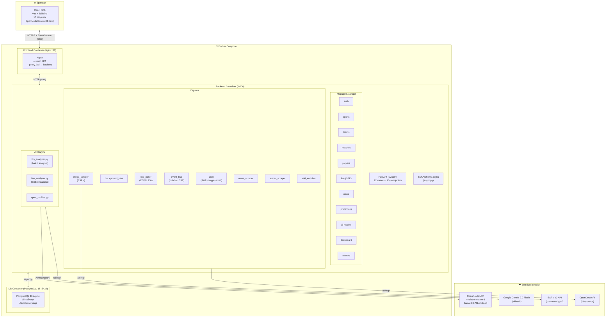
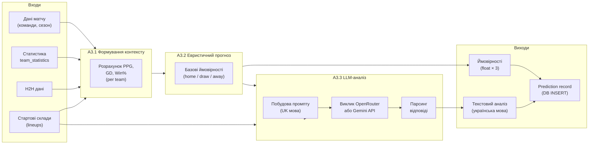

# Архітектурна діаграма системи

```mermaid
graph TB
    subgraph Browser["🌐 Браузер"]
        FE["React SPA\nVite + Tailwind\n15 сторінок\nSportModeContext (6 тем)"]
    end

    subgraph Docker["🐳 Docker Compose"]
        subgraph FEContainer["Frontend Container (Nginx :80)"]
            NGINX["Nginx\n– static SPA\n– proxy /api → backend"]
        end

        subgraph BEContainer["Backend Container (:8000)"]
            FastAPI["FastAPI (uvicorn)\n12 routers · 40+ endpoints"]

            subgraph Routers["Маршрутизатори"]
                Auth["auth"]
                Sports["sports"]
                Teams["teams"]
                Matches["matches"]
                Players["players"]
                Live["live (SSE)"]
                News["news"]
                Preds["predictions"]
                AIR["ai-models"]
                Dash["dashboard"]
                Avs["avatars"]
            end

            subgraph Services["Сервіси"]
                AuthSvc["auth\n(JWT+bcrypt+email)"]
                BgJobs["background_jobs"]
                Poller["live_poller\n(ESPN, 15s)"]
                EventBus["event_bus\n(pub/sub SSE)"]
                MegaScraper["mega_scraper\n(ESPN)"]
                NewsScraper["news_scraper"]
                AvatarScraper["avatar_scraper"]
                WikiEnricher["wiki_enricher"]
            end

            subgraph AI["AI модуль"]
                LLMAnal["llm_analyzer.py\n(batch analysis)"]
                LiveAnal["live_analyzer.py\n(SSE streaming)"]
                SportProf["sport_profiles.py"]
            end

            ORM["SQLAlchemy async\n(asyncpg)"]
        end

        subgraph DBContainer["DB Container (PostgreSQL 16 :5432)"]
            PG["PostgreSQL 16 Alpine\n15 таблиць\nAlembic міграції"]
        end
    end

    subgraph External["☁️ Зовнішні сервіси"]
        OR["OpenRouter API\nnvidia/nemotron-3\nllama-3.3-70b-instruct"]
        GEM["Google Gemini 2.0 Flash\n(fallback)"]
        ESPN_EXT["ESPN v2 API\n(спортивні дані)"]
        OpenDota["OpenDota API\n(кіберспорт)"]
    end

    Browser <-->|"HTTPS + EventSource (SSE)"| FEContainer
    FEContainer <-->|"HTTP proxy"| BEContainer
    BEContainer <-->|"asyncpg"| DBContainer

    AI -->|"AsyncOpenAI"| OR
    AI -->|"fallback"| GEM
    MegaScraper -->|"aiohttp"| ESPN_EXT
    Services -->|"aiohttp"| OpenDota
```

# IDEF0 — Декомпозиція блоку A3 (Прогнозування)

```mermaid
flowchart LR
    subgraph Inputs["Входи"]
        I1["Дані матчу\n(команди, сезон)"]
        I2["Статистика\nteam_statistics"]
        I3["H2H дані"]
        I4["Стартові склади\n(lineups)"]
    end

    subgraph A31["A3.1 Формування контексту"]
        C1["Розрахунок PPG,\nGD, Win%\n(per team)"]
    end

    subgraph A32["A3.2 Евристичний прогноз"]
        C2["Базові ймовірності\n(home / draw / away)"]
    end

    subgraph A33["A3.3 LLM-аналіз"]
        C3["Побудова промпту\n(UK мова)"]
        C4["Виклик OpenRouter\nабо Gemini API"]
        C5["Парсинг\nвідповіді"]
    end

    subgraph Outputs["Виходи"]
        O1["Ймовірності\n(float × 3)"]
        O2["Текстовий аналіз\n(українська мова)"]
        O3["Prediction record\n(DB INSERT)"]
    end

    I1 --> A31
    I2 --> A31
    I3 --> A31
    I4 --> A31

    A31 --> A32
    A32 --> O1
    A32 --> A33
    I4 --> A33

    A33 --> C3 --> C4 --> C5 --> O2

    O1 --> O3
    O2 --> O3
```
