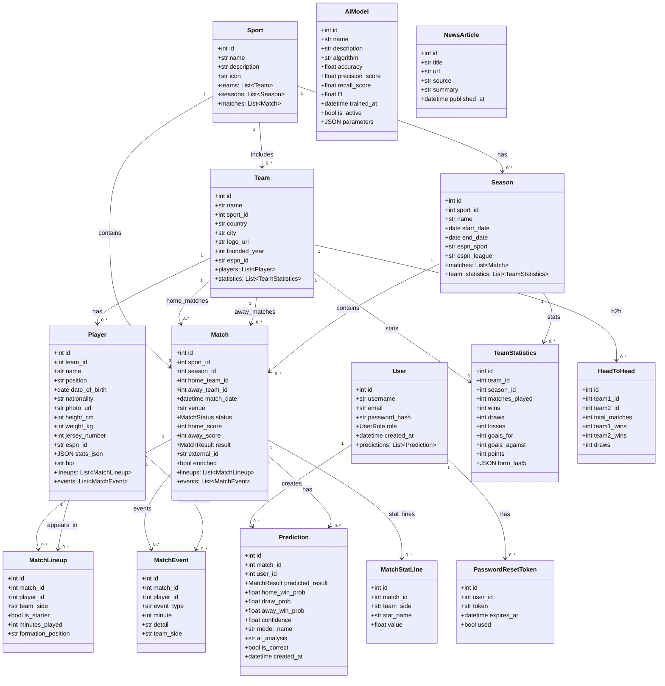

# Діаграма класів (Class Diagram)

```mermaid
classDiagram
    class User {
        +int id
        +str username
        +str email
        +str password_hash
        +UserRole role
        +datetime created_at
        +predictions: List~Prediction~
    }

    class PasswordResetToken {
        +int id
        +int user_id
        +str token
        +datetime expires_at
        +bool used
    }

    class Sport {
        +int id
        +str name
        +str description
        +str icon
        +teams: List~Team~
        +seasons: List~Season~
        +matches: List~Match~
    }

    class Team {
        +int id
        +str name
        +int sport_id
        +str country
        +str city
        +str logo_url
        +int founded_year
        +str espn_id
        +players: List~Player~
        +statistics: List~TeamStatistics~
    }

    class Player {
        +int id
        +int team_id
        +str name
        +str position
        +date date_of_birth
        +str nationality
        +str photo_url
        +int height_cm
        +int weight_kg
        +int jersey_number
        +str espn_id
        +JSON stats_json
        +str bio
        +lineups: List~MatchLineup~
        +events: List~MatchEvent~
    }

    class Season {
        +int id
        +int sport_id
        +str name
        +date start_date
        +date end_date
        +str espn_sport
        +str espn_league
        +matches: List~Match~
        +team_statistics: List~TeamStatistics~
    }

    class Match {
        +int id
        +int sport_id
        +int season_id
        +int home_team_id
        +int away_team_id
        +datetime match_date
        +str venue
        +MatchStatus status
        +int home_score
        +int away_score
        +MatchResult result
        +str external_id
        +bool enriched
        +lineups: List~MatchLineup~
        +events: List~MatchEvent~
    }

    class MatchLineup {
        +int id
        +int match_id
        +int player_id
        +str team_side
        +bool is_starter
        +int minutes_played
        +str formation_position
    }

    class MatchEvent {
        +int id
        +int match_id
        +int player_id
        +str event_type
        +int minute
        +str detail
        +str team_side
    }

    class MatchStatLine {
        +int id
        +int match_id
        +str team_side
        +str stat_name
        +float value
    }

    class TeamStatistics {
        +int id
        +int team_id
        +int season_id
        +int matches_played
        +int wins
        +int draws
        +int losses
        +int goals_for
        +int goals_against
        +int points
        +JSON form_last5
    }

    class HeadToHead {
        +int id
        +int team1_id
        +int team2_id
        +int total_matches
        +int team1_wins
        +int team2_wins
        +int draws
    }

    class Prediction {
        +int id
        +int match_id
        +int user_id
        +MatchResult predicted_result
        +float home_win_prob
        +float draw_prob
        +float away_win_prob
        +float confidence
        +str model_name
        +str ai_analysis
        +bool is_correct
        +datetime created_at
    }

    class AIModel {
        +int id
        +str name
        +str description
        +str algorithm
        +float accuracy
        +float precision_score
        +float recall_score
        +float f1
        +datetime trained_at
        +bool is_active
        +JSON parameters
    }

    class NewsArticle {
        +int id
        +str title
        +str url
        +str source
        +str summary
        +datetime published_at
    }

    %% Relationships
    User "1" --> "0..*" Prediction : creates
    User "1" --> "0..*" PasswordResetToken : has
    Sport "1" --> "0..*" Team : includes
    Sport "1" --> "0..*" Season : has
    Sport "1" --> "0..*" Match : contains
    Team "1" --> "0..*" Player : has
    Team "1" --> "0..*" TeamStatistics : stats
    Team "1" --> "0..*" Match : home_matches
    Team "1" --> "0..*" Match : away_matches
    Team "1" --> "0..*" HeadToHead : h2h
    Season "1" --> "0..*" Match : contains
    Season "1" --> "0..*" TeamStatistics : stats
    Match "1" --> "0..*" Prediction : has
    Match "1" --> "0..*" MatchLineup : lineups
    Match "1" --> "0..*" MatchEvent : events
    Match "1" --> "0..*" MatchStatLine : stat_lines
    Player "1" --> "0..*" MatchLineup : appears_in
    Player "1" --> "0..*" MatchEvent : participates
```
