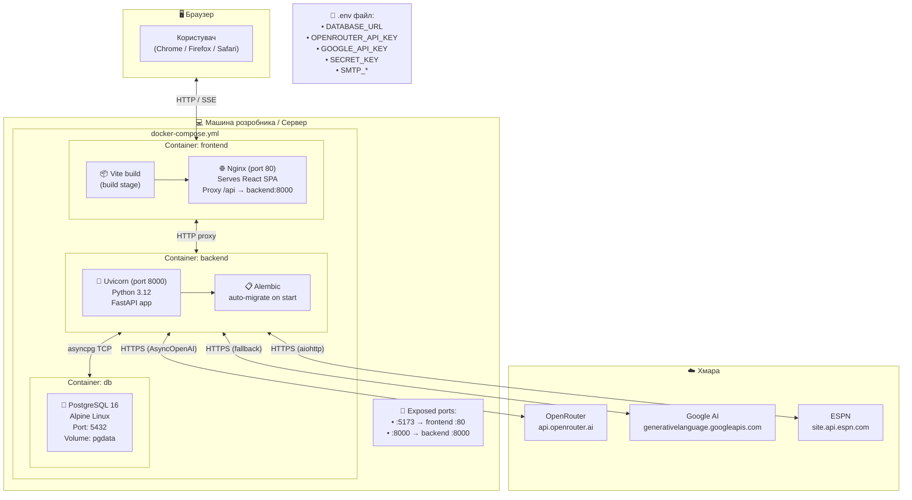
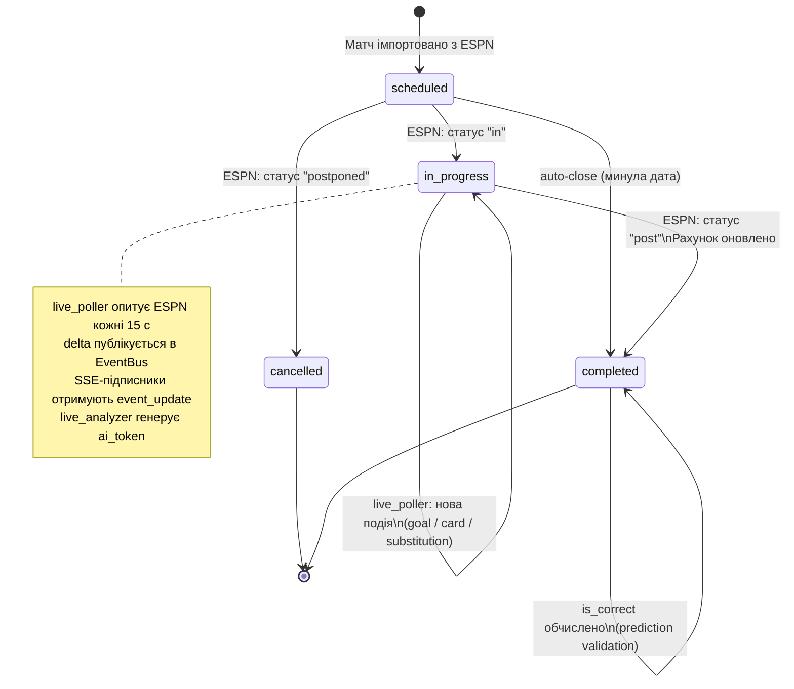

# Діаграма розгортання (Deployment Diagram)

```mermaid
graph TB
    subgraph Dev["💻 Машина розробника / Сервер"]
        subgraph DC["docker-compose.yml"]
            subgraph DB_C["Container: db"]
                PG["🐘 PostgreSQL 16\nAlpine Linux\nPort: 5432\nVolume: pgdata"]
            end

            subgraph BE_C["Container: backend"]
                UV["🦄 Uvicorn (port 8000)\nPython 3.12\nFastAPI app"]
                ALEMBIC["📋 Alembic\nauto-migrate on start"]
                UV --> ALEMBIC
            end

            subgraph FE_C["Container: frontend"]
                NG["🌐 Nginx (port 80)\nServes React SPA\nProxy /api → backend:8000"]
                VITE["📦 Vite build\n(build stage)"]
                VITE --> NG
            end
        end

        PORTS["🔌 Exposed ports:\n• :5173 → frontend :80\n• :8000 → backend :8000"]
    end

    subgraph Cloud["☁️ Хмара"]
        OR["OpenRouter\napi.openrouter.ai"]
        GEM["Google AI\ngenerativelanguage.googleapis.com"]
        ESPN_C["ESPN\nsite.api.espn.com"]
    end

    subgraph Browser_["🖥️ Браузер"]
        USER["Користувач\n(Chrome / Firefox / Safari)"]
    end

    BE_C <-->|"asyncpg TCP"| DB_C
    BE_C <-->|"HTTPS (aiohttp)"| ESPN_C
    BE_C <-->|"HTTPS (AsyncOpenAI)"| OR
    BE_C <-->|"HTTPS (fallback)"| GEM
    FE_C <-->|"HTTP proxy"| BE_C
    Browser_ <-->|"HTTP / SSE"| FE_C

    note["📝 .env файл:\n• DATABASE_URL\n• OPENROUTER_API_KEY\n• GOOGLE_API_KEY\n• SECRET_KEY\n• SMTP_*"]
```

# Діаграма стану матчу (State Diagram)

```mermaid
stateDiagram-v2
    [*] --> scheduled : Матч імпортовано з ESPN

    scheduled --> in_progress : ESPN: статус "in"
    scheduled --> cancelled : ESPN: статус "postponed"
    scheduled --> completed : auto-close (минула дата)

    in_progress --> completed : ESPN: статус "post"\nРахунок оновлено
    in_progress --> in_progress : live_poller: нова подія\n(goal / card / substitution)

    completed --> completed : is_correct обчислено\n(prediction validation)
    cancelled --> [*]
    completed --> [*]

    note right of in_progress
        live_poller опитує ESPN кожні 15 с
        delta публікується в EventBus
        SSE-підписники отримують event_update
        live_analyzer генерує ai_token
    end note
```
