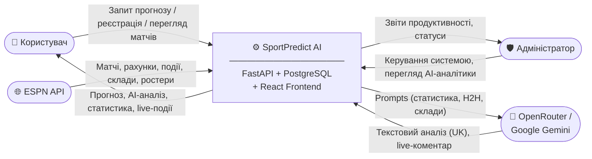
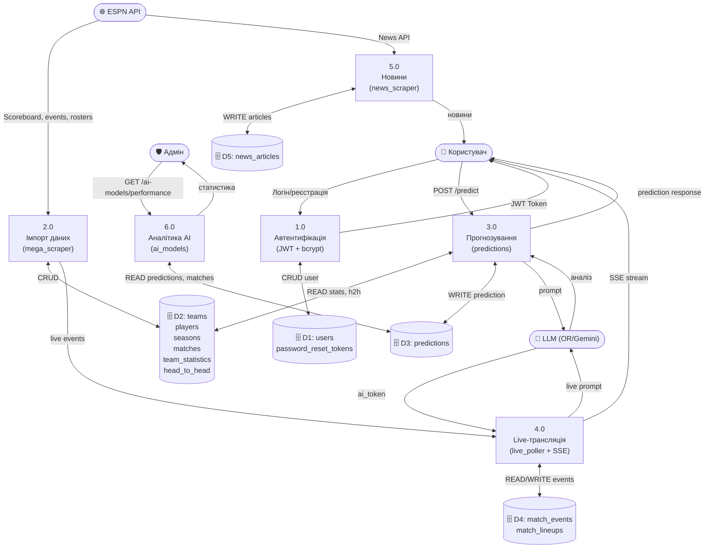

# DFD (Data Flow Diagram) — SportPredict AI

## Рівень 0 — Контекстна діаграма

```mermaid
flowchart LR
    User(["👤 Користувач"])
    Admin(["🛡️ Адміністратор"])
    ESPN(["🌐 ESPN API"])
    LLM(["🤖 OpenRouter /\nGoogle Gemini"])

    SYS["⚙️ SportPredict AI\n—————————————\nFastAPI + PostgreSQL\n+ React Frontend"]

    User -->|"Запит прогнозу / реєстрація / перегляд матчів"| SYS
    SYS -->|"Прогноз, AI-аналіз, статистика, live-події"| User

    Admin -->|"Керування системою, перегляд AI-аналітики"| SYS
    SYS -->|"Звіти продуктивності, статуси"| Admin

    ESPN -->|"Матчі, рахунки, події, склади, ростери"| SYS
    LLM -->|"Текстовий аналіз (UK), live-коментар"| SYS
    SYS -->|"Prompts (статистика, H2H, склади)"| LLM
```

## Рівень 1 — Декомпозиція системи

```mermaid
flowchart TD
    User(["👤 Користувач"])
    Admin(["🛡️ Адмін"])
    ESPN(["🌐 ESPN API"])
    LLM(["🤖 LLM (OR/Gemini)"])

    P1["1.0\nАвтентифікація\n(JWT + bcrypt)"]
    P2["2.0\nІмпорт даних\n(mega_scraper)"]
    P3["3.0\nПрогнозування\n(predictions)"]
    P4["4.0\nLive-трансляція\n(live_poller + SSE)"]
    P5["5.0\nНовини\n(news_scraper)"]
    P6["6.0\nАналітика AI\n(ai_models)"]

    D1[("🗄️ D1: users\npassword_reset_tokens")]
    D2[("🗄️ D2: teams\nplayers\nseasons\nmatches\nteam_statistics\nhead_to_head")]
    D3[("🗄️ D3: predictions")]
    D4[("🗄️ D4: match_events\nmatch_lineups")]
    D5[("🗄️ D5: news_articles")]

    User -->|"Логін/реєстрація"| P1
    P1 -->|"JWT Token"| User
    P1 <-->|"CRUD user"| D1

    ESPN -->|"Scoreboard, events, rosters"| P2
    P2 <-->|"CRUD"| D2

    User -->|"POST /predict"| P3
    P3 <-->|"READ stats, h2h"| D2
    P3 <-->|"WRITE prediction"| D3
    P3 -->|"prompt"| LLM
    LLM -->|"аналіз"| P3
    P3 -->|"prediction response"| User

    P2 -->|"live events"| P4
    P4 <-->|"READ/WRITE events"| D4
    P4 -->|"SSE stream"| User
    P4 -->|"live prompt"| LLM
    LLM -->|"ai_token"| P4

    ESPN -->|"News API"| P5
    P5 <-->|"WRITE articles"| D5
    P5 -->|"новини"| User

    Admin -->|"GET /ai-models/performance"| P6
    P6 <-->|"READ predictions, matches"| D3
    P6 -->|"статистика"| Admin
```
