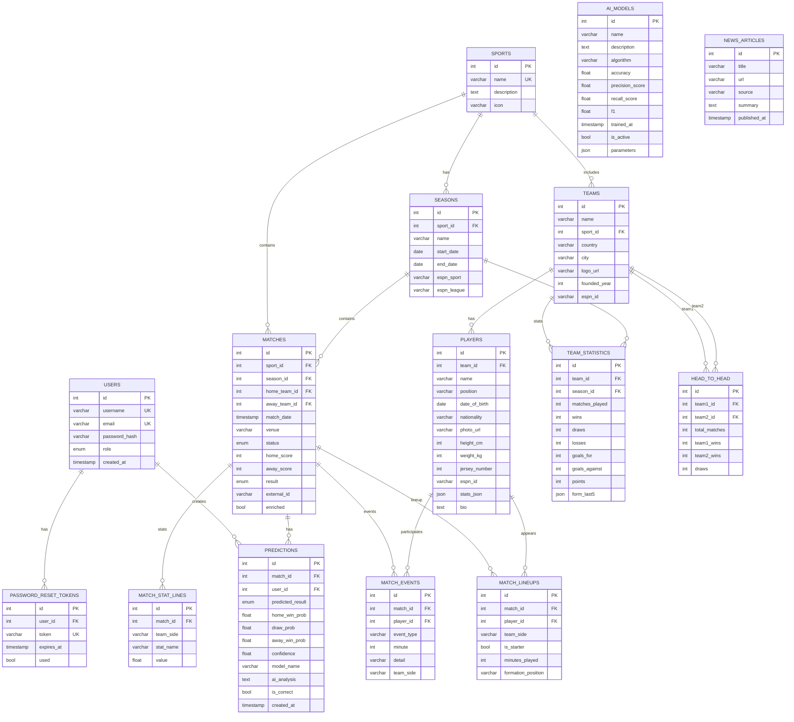

# ER-Діаграма — SportPredict AI

```mermaid
erDiagram
    USERS {
        int id PK
        varchar username UK
        varchar email UK
        varchar password_hash
        enum role
        timestamp created_at
    }
    PASSWORD_RESET_TOKENS {
        int id PK
        int user_id FK
        varchar token UK
        timestamp expires_at
        bool used
    }
    SPORTS {
        int id PK
        varchar name UK
        text description
        varchar icon
    }
    TEAMS {
        int id PK
        varchar name
        int sport_id FK
        varchar country
        varchar city
        varchar logo_url
        int founded_year
        varchar espn_id
    }
    PLAYERS {
        int id PK
        int team_id FK
        varchar name
        varchar position
        date date_of_birth
        varchar nationality
        varchar photo_url
        int height_cm
        int weight_kg
        int jersey_number
        varchar espn_id
        json stats_json
        text bio
    }
    SEASONS {
        int id PK
        int sport_id FK
        varchar name
        date start_date
        date end_date
        varchar espn_sport
        varchar espn_league
    }
    MATCHES {
        int id PK
        int sport_id FK
        int season_id FK
        int home_team_id FK
        int away_team_id FK
        timestamp match_date
        varchar venue
        enum status
        int home_score
        int away_score
        enum result
        varchar external_id
        bool enriched
    }
    MATCH_LINEUPS {
        int id PK
        int match_id FK
        int player_id FK
        varchar team_side
        bool is_starter
        int minutes_played
        varchar formation_position
    }
    MATCH_EVENTS {
        int id PK
        int match_id FK
        int player_id FK
        varchar event_type
        int minute
        varchar detail
        varchar team_side
    }
    MATCH_STAT_LINES {
        int id PK
        int match_id FK
        varchar team_side
        varchar stat_name
        float value
    }
    TEAM_STATISTICS {
        int id PK
        int team_id FK
        int season_id FK
        int matches_played
        int wins
        int draws
        int losses
        int goals_for
        int goals_against
        int points
        json form_last5
    }
    HEAD_TO_HEAD {
        int id PK
        int team1_id FK
        int team2_id FK
        int total_matches
        int team1_wins
        int team2_wins
        int draws
    }
    PREDICTIONS {
        int id PK
        int match_id FK
        int user_id FK
        enum predicted_result
        float home_win_prob
        float draw_prob
        float away_win_prob
        float confidence
        varchar model_name
        text ai_analysis
        bool is_correct
        timestamp created_at
    }
    AI_MODELS {
        int id PK
        varchar name
        text description
        varchar algorithm
        float accuracy
        float precision_score
        float recall_score
        float f1
        timestamp trained_at
        bool is_active
        json parameters
    }
    NEWS_ARTICLES {
        int id PK
        varchar title
        varchar url
        varchar source
        text summary
        timestamp published_at
    }

    USERS ||--o{ PASSWORD_RESET_TOKENS : "has"
    USERS ||--o{ PREDICTIONS : "creates"
    SPORTS ||--o{ TEAMS : "includes"
    SPORTS ||--o{ SEASONS : "has"
    SPORTS ||--o{ MATCHES : "contains"
    TEAMS ||--o{ PLAYERS : "has"
    TEAMS ||--o{ TEAM_STATISTICS : "stats"
    TEAMS ||--o{ HEAD_TO_HEAD : "team1"
    TEAMS ||--o{ HEAD_TO_HEAD : "team2"
    SEASONS ||--o{ MATCHES : "contains"
    SEASONS ||--o{ TEAM_STATISTICS : "stats"
    MATCHES ||--o{ PREDICTIONS : "has"
    MATCHES ||--o{ MATCH_LINEUPS : "lineup"
    MATCHES ||--o{ MATCH_EVENTS : "events"
    MATCHES ||--o{ MATCH_STAT_LINES : "stats"
    PLAYERS ||--o{ MATCH_LINEUPS : "appears"
    PLAYERS ||--o{ MATCH_EVENTS : "participates"
```
