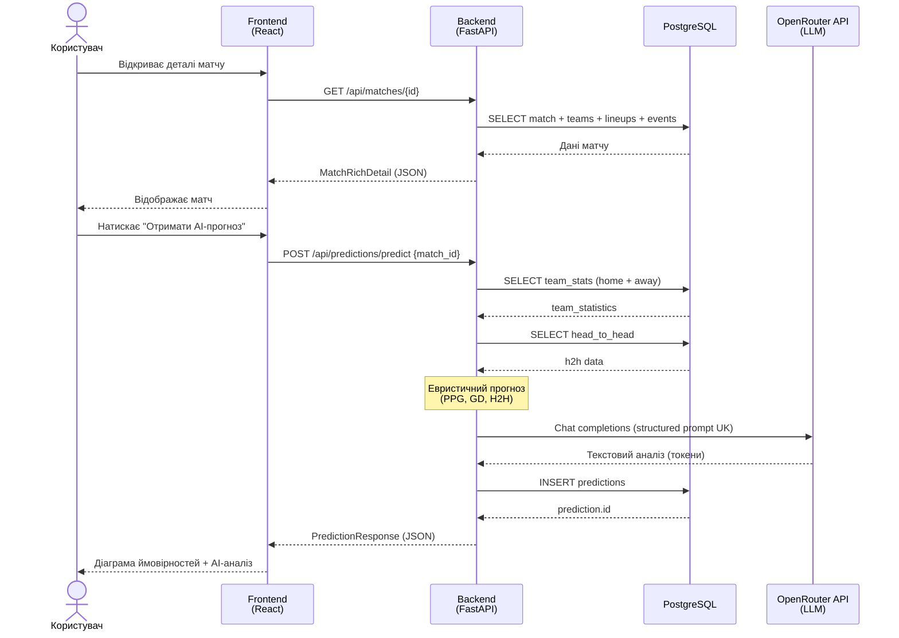
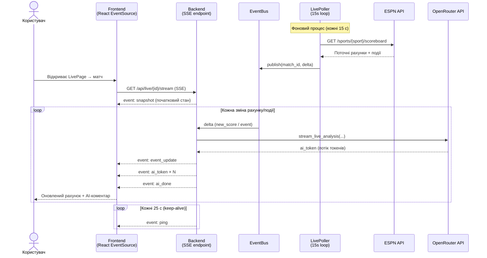

# Діаграма послідовностей — Процес AI-прогнозування

```mermaid
sequenceDiagram
    actor User as Користувач
    participant FE as Frontend<br/>(React)
    participant API as Backend<br/>(FastAPI)
    participant DB as PostgreSQL
    participant LLM as OpenRouter API<br/>(LLM)

    User->>FE: Відкриває деталі матчу
    FE->>API: GET /api/matches/{id}
    API->>DB: SELECT match + teams + lineups + events
    DB-->>API: Дані матчу
    API-->>FE: MatchRichDetail (JSON)
    FE-->>User: Відображає матч

    User->>FE: Натискає "Отримати AI-прогноз"
    FE->>API: POST /api/predictions/predict {match_id}
    API->>DB: SELECT team_stats (home + away)
    DB-->>API: team_statistics
    API->>DB: SELECT head_to_head
    DB-->>API: h2h data
    Note over API: Евристичний прогноз<br/>(PPG, GD, H2H)
    API->>LLM: Chat completions (structured prompt UK)
    LLM-->>API: Текстовий аналіз (токени)
    API->>DB: INSERT predictions
    DB-->>API: prediction.id
    API-->>FE: PredictionResponse (JSON)
    FE-->>User: Діаграма ймовірностей + AI-аналіз
```

# Діаграма послідовностей — Live-трансляція матчу

```mermaid
sequenceDiagram
    actor User as Користувач
    participant FE as Frontend<br/>(React EventSource)
    participant API as Backend<br/>(SSE endpoint)
    participant BUS as EventBus
    participant POLLER as LivePoller<br/>(15s loop)
    participant ESPN as ESPN API
    participant LLM as OpenRouter API

    Note over POLLER: Фоновий процес (кожні 15 с)
    POLLER->>ESPN: GET /sports/{sport}/scoreboard
    ESPN-->>POLLER: Поточні рахунки + події
    POLLER->>BUS: publish(match_id, delta)

    User->>FE: Відкриває LivePage → матч
    FE->>API: GET /api/live/{id}/stream (SSE)
    API-->>FE: event: snapshot (початковий стан)

    loop Кожна зміна рахунку/події
        BUS->>API: delta (new_score / event)
        API->>LLM: stream_live_analysis(...)
        LLM-->>API: ai_token (потік токенів)
        API-->>FE: event: event_update
        API-->>FE: event: ai_token × N
        API-->>FE: event: ai_done
        FE-->>User: Оновлений рахунок + AI-коментар
    end

    loop Кожні 25 с (keep-alive)
        API-->>FE: event: ping
    end
```
