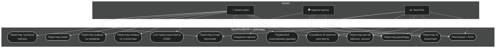

# Діаграма прецедентів (Use Case Diagram)

```mermaid
%%{init: {'theme': 'dark'}}%%
flowchart TD
    subgraph Actors
        U["👤 Користувач"]
        A["🛡️ Адміністратор"]
        AN["📊 Аналітик"]
    end

    subgraph SportPredict_AI["SportPredict AI — Система"]
        UC1(["Реєстрація / Логін"])
        UC2(["Скидання пароля"])
        UC3(["Перегляд дашборду"])
        UC4(["Перегляд матчів\n(фільтр, пошук)"])
        UC5(["Отримати AI-прогноз\nдля матчу"])
        UC6(["Live-трансляція матчу\n(SSE)"])
        UC7(["Перегляд команд\nта статистики"])
        UC8(["Перегляд гравців\nта профілів"])
        UC9(["Перегляд новин"])
        UC10(["Перегляд турнірної\nтаблиці"])
        UC11(["Перегляд історії\nпрогнозів"])
        UC12(["Перегляд AI\nАналітики"])
        UC13(["Управління\nспортивними даними"])
    end

    U --> UC1
    U --> UC2
    U --> UC3
    U --> UC4
    U --> UC5
    U --> UC6
    U --> UC7
    U --> UC8
    U --> UC9
    U --> UC10
    U --> UC11

    AN --> UC1
    AN --> UC3
    AN --> UC4
    AN --> UC5
    AN --> UC11
    AN --> UC12

    A --> UC1
    A --> UC3
    A --> UC12
    A --> UC13
```
