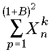

> Міністерство освіти і науки України Національний університет
> “Львівська політехніка” Кафедра автоматизованих систем управління
>
> **Методичні** **вказівки**
>
> **до** **курсового** **проєктування**
>
> з дисципліни **«Проектування** **інформаційних** **систем»**
>
> для студентів за спеціальністю **122** **«Комп’ютерні** **науки»**
> **освітньої** **програми**
>
> **<u>«Комп’ютерні науки (Обчислювальний інтелект смарт-систем)»</u>**
>
> **Львів-2026**
>
> Методичні вказівки до виконання курсової роботи з дисципліни
> “Проектування інформаційних систем” для студентів спеціальності 122
> “Комп’ютерні науки” Укл. Дорошенко А.В., Львів: Національний
> університет “Львівська політехніка”, 2026.
>
> Методичні вказівки обговорено та схвалено на засіданні кафедри АСУ
> Протокол № \_\_\_\_\_\_\_\_\_\_\_ від
> «\_\_\_»\_\_\_\_\_\_\_\_\_\_\_2026 р.
>
> Завідувач кафедрою АСУ \_\_\_\_\_\_\_\_\_\_\_\_\_\_ ***Теслюк***
> ***В.М.***
>
> Методичні вказівки обговорено та схвалено на засіданні методичної
> комісії базового напрямку підготовки
>
> Протокол № \_\_\_\_\_\_\_\_\_\_\_ від
> «\_\_\_»\_\_\_\_\_\_\_\_\_\_\_2026 р.
>
> 1
>
> **Зміст**

Вступ…………………………………………………………………………………2 1 Основні етапи виконання роботи
………………………………………………..4

> 1.1 Огляд літератури за темою курсової роботи………………………….4 1.2
> Моделювання процесів предметної області……………………………..4 1.3
> Концептуальне проектування предметної області ……………………..5 1.4
> Проектування й розробка ужитку бази даних……………………………6

2\. Тематика курсової роботивання………………………………………………7 3. Вимоги до
курсової роботи……………………………………………………8

> 3.1 Обсяг та зміст курсової роботи…………………………………………8 3.2 Оформлення
> пояснювальної записки……………………………………11
>
> Список рекомендованої літератури……….………………………………………20 Додаток А.
> Приклад оформлення титульної сторінки…………………………..23 Додаток Б. Бланк
> завдання для курсової роботи……………………………..24 Додаток В. Варіанти
> завдань для виконання в курсовому проекті…………...25
>
> 2
>
> **Вступ**
>
> В зв‘язку з великими труднощами управління проектами розробки та
> впровадження великих інформаційних систем досить широку популярність
> отримали CASE-засоби – засоби автоматизації проектування і моделювання
> інформаційних систем.
>
> Моделювання системи дозволяє скоротити час розробки системи, що
> проектується і дає можливість створення системи з потрібною якістю.
> Модель системи допомагає на стадії проектування без вкладання великих
> коштів в пілотний проект отримати уявлення про поведінку системи і
> уникнути подальших помилок, коли в написання програмного коду уже
> вкладені значні сили.
>
> Метою курсової роботи з дисципліни «Проектування інформаційних систем»
> є закріплення студентами теоретичних знань про методи й засоби
> проектування інформаційних систем і отримання практичних навичок їх
> аналізу з погляду застосування для розв'язання практичних задач
> створення ужитків баз даних та інших інформаційних систем.
>
> Курсова робота передбачає поетапне виконання з демонстрацією кожного з
> етапів і виходом на виконання наступного відповідно до плану. До
> використання при виконанні курсової роботи рекомендуються такі CASE –
> засоби, як Rational Rose, PowerDesigner, ERWin, BPWin та ARIS.
>
> Основними завданнями виконання курсової роботи є:
>
> − більш детальне вивчення принципів і процесів аналізу предметної
> області для створення автоматизованих систем;
>
> − закріплення навичок проектування концептуальної схеми даних і
> ужитків, а також реалізації обмежень предметної області;
>
> − опис моделі бізнес процесів, що виникають на підприємстві та її
> реалізація в моделі інформаційної системи з описом програмно-технічних
> вимог, використовуючи інструментарій CASE –засобів;
>
> − більш детальне вивчення СУБД як основи побудови інформаційних
> систем;
>
> 3
>
> − закріплення навичок використання CASE-засобів для створення
>
> інформаційних систем.
>
> 4
>
> **1** **Основні** **етапи** **виконання** **роботи**
>
> **1.1** **Огляд** **літератури** **за** **темою** **курсової**
> **роботи**
>
> На основі виданого завдання здійснюється аналіз рекомендованої
> літератури, збираються початкові відомості про розглянуту предметну
> область (діяльності підприємства, функціонування служб).
>
> Під час огляду літературних джерел необхідно порівняти існуючі
> методології проектування інформаційних систем, обрати найкращу для
> розроблюваної системи, обґрунтувати свій вибір. Описати яку модель
> життєвого циклу (ЖЦ) розробки програмного забезпечення використовує
> дана методологія і надалі виконувати Курсова робота із дотриманням
> всіх етапів розробки відповідно до обраної моделі ЖЦ.
>
> Також необхідно розглянути існуючі аналоги розроблюваної системи,
> визначити їх переваги та недоліки, обґрунтувати актуальність
> розроблення даного класу систем.
>
> Огляд літератури повинен містити посилання на використані джерела (в
> квадратних дужках), список всіх використаних літературних джерел
> наводиться в кінці пояснювальної записки та оформляється згідно ДСТУ
> ГОСТ 7.1:2006 “Система стандартів з інформації, бібліотечної та
> видавничої справи. Бібліографічний запис. Бібліографічний опис.
> Загальні вимоги та правила складання”.
>
> **1.2** **Моделювання** **процесів** **предметної** **області**
>
> На підставі огляду літературних джерел та зібраного матеріалу про
>
> предметну область, здійснюється опис предметної області за допомогою
> відомих стандартів моделювання процесів (IDEF0, UML). На схемах
> повинні бути відображені суттєві для розглянутої теми бізнеси-процеси.
> Також необхідне відображення процесів у даній предметній області після
> впровадження розроблювальної інформаційної системи.
>
> 5
>
> В курсовому проекті обов’язково повинні бути такі діаграми: IDEF0
>
> (декомпозиція до 3-го рівня), DFD, IDEF1x, IDEF3, UML (діаграма
> прецедентів, діаграма послідовностей та класів – обов’язково, інші –
> за бажанням).
>
> У якості засобів реалізації можуть бути використані будь-які пакети
> програм, що дозволяють проводити проектування відповідно до обраного
> стандарту. Наприклад All Fusion BPwin, All Fusion Process Modeler,
> Rational Rose, PowerDesigner, Enterprice Architect, Argouml тощо.
>
> **1.3** **Концептуальне** **проектування** **предметної** **області**
>
> На основі сформованої на попередньому етапі моделі процесів предметної
> області здійснюється концептуальне проектування. Здійснюється вибір
> використовуваної моделі даних, а також будується схема
> використовуваної в інформаційній системі бази даних (логічна
> (концептуальна), фізична).
>
> Основними питаннями, які звичайно повинні бути розкриті, є: –
> виділення окремих сутностей, а також їх атрибутів;
>
> – виділення й обґрунтування зв'язків між сутностями, а також вказання
> типів зв'язків (« один-до-багатьох», « багато-до-багатьох», «
> один-до-одного»);
>
> – правила цілісності бази даних виходячи з обмежень предметної
> області;
>
> – способи доступу до даних;
>
> – забезпечення безпеки даних.
>
> Проектування може здійснюватися в будь-якому програмному продукті, що
> здійснює моделювання відповідно до концепції «сутність-зв'язок»
> (наприклад, All Fusion Erwin, PowerDesigner ).
>
> Проектування здійснюється під цільову СУБД, вибір якої здійснюється
> студентом самостійно виходячи із власних навичок роботи (наприклад
> MySql, MS SQL Server, PostgreSql, Oracle, Firebird, Interbase тощо).
>
> 6
>
> **1.4** **Проектування** **й** **розробка** **додатка** **бази**
> **даних**
>
> На основі результатів попередніх етапів здійснюється проектування
> додатка бази даних, що здійснює контрольований доступ до даних.
> Проводиться конструювання візуальних форм, а також проектування логіки
> діалогу з користувачем (дія керуючих елементів, логіка перемикання між
> формами). Також описуються виконувані в додатку запити на вставку,
> модифікацію й добування даних.
>
> Додаток може бути розроблений як із використанням конкретного
> середовища розробки для цільової архітектури (Eclipse, Visual Studio
> тощо), так й із застосуванням засобів Web-Програмування.
>
> 7
>
> **2** **Тематика** **курсових** **робіт**
>
> Завдання на курсову роботу в основному базуються на лекційному
> матеріалі дисципліни «Проектування інформаційних систем». Частина тем
> трохи розширює межі розглянутого на лекціях матеріалу.
>
> Завдання на курсову роботу є індивідуальним.
>
> Можна виділити такі основні напрямки тематики курсових робіт:
>
> 1\. Інформаційна система, що автоматизує діяльність деякого
> підприємства або організації.
>
> 2\. Інформаційна система деякої служби (наприклад, Інтернет-Магазин,
> система обліку, система авторизації, біллінгова система)
>
> 3\. Інформаційна підсистема складного програмного продукту (модулі
> САПР).
>
> Тема курсової роботи може бути пов’язана із тематикою бакалаврської
> роботи або бути обрана із запропонованих варіантів (Додаток В). В
> будь-якому випадку, тема курсової роботи ***обов’язково***
> ***повинна*** ***бути*** ***узгоджена*** ***із*** ***керівником***
> ***курсової*** ***роботи,*** ***повинно*** ***бути***
> ***сформульоване*** ***завдання*** ***на*** ***КП,*** ***оформлений***
> ***відповідно*** ***до*** ***зразку*** ***(Додаток*** ***Б)***
> ***на*** ***початку*** ***семестру.***
>
> 8
>
> **3** **Вимоги** **до** **курсової** **роботи**
>
> **3.1** **Обсяг** **і** **зміст** **курсової** **роботи**
>
> Загальний обсяг пояснювальної записки (без додатків): 30-35 сторінок.
> Огляд літератури повинен бути обсягом не більше 20 % роботи.
> Пояснювальна записка до курсової роботи повинна давати досить повну
>
> уяву про всі етапи роботи, виконаної студентом. Записка ілюструється
> схемами, таблицями, графіками та ін.
>
> **Структура** **пояснювальної** **записки**
>
> Пояснювальна записка до курсової роботи повинна включати такі пункти:
>
> 1\) Титульний лист (додаток А).
>
> 2\) Зміст роботи включає найменування всіх розділів курсової роботи, а
> також підрозділів і пунктів, якщо вони мають найменування, із
> вказівкою номера сторінки, на якій розміщається початок матеріалу
> розділу, підрозділу, пункту. 3) Бланк завдання (додаток Б).
>
> 4\) Вступ.
>
> 4\) Постановка задачі. Містить загальний опис розглянутої предметної
> області, існуючого стану речей, а також ті недоліки, які можливо
> виправити за допомогою розробки інформаційної системи. Також
> формулюється мета курсової роботи й перелік питань, що підлягають
> розгляду в процесі її виконання.
>
> 5\) Технічне завдання.
>
> ➢Загальний опис системи, що розробляється;· ➢Глосарій/словник
> термінів, абревіатур, понять і скорочень;
>
> ➢· Опис предметної області з переліком вимог, що накладаються; ➢·
> Перелік учасників системи;
>
> ➢· Перелік компонентів системи; ➢· Опис процесу розробки;
>
> ➢· Функціональні і технічні вимоги до системи;
>
> 9
>
> ➢ Аналіз чинників ризику (фінансові, технічні, організаційні,
>
> конкуренції, попиту і т. д.)
>
> **Основна** **частина** складається з розділів, перелік і порядок
> проходження яких автор вибирає відповідно до теми курсової роботи та
> обраної методології розробки інформаційної системи. Найменування
> структурних елементів основної частини повинні бути осмисленими і явно
> характеризувати сутність розглянутого в даному розділі (підрозділі або
> пункті) питання. Зміст розділів повинен описувати виконані роботи,
> чітко позначати отримані результати. **Огляд** **літератури:**
>
> 6\) Опис вибраної методології проектування.
>
> 7\) Порівняння вибраної методології з іншими існуючими методологіями
> щодо переваг і недоліків, які зводяться в єдину таблицю.
>
> 8\) Опис вибраного для проектування CASE –засобу. 9) Опис системи, що
> проектується.
>
> **Моделювання** **процесів** **предметної** **області**
>
> 10\) Визначення внутрішніх і зовнішніх сутностей додатка.
>
> 11\) Визначення бізнес-процесів і потоків даних у вигляді схем із
> описом дій. 12) Функціонально-логічну схему проектованої системи з
> деталізацією до 3-го рівня.
>
> 13\) Схему даних проектованої системи з деталізацією до 3-го рівня.
> **Концептуальне** **проектування** **предметної** **області**
>
> 14\) Структури реляційних таблиць бази даних відповідно до схеми
> даних. 15) Схему «пілотного» впровадження системи, що розробляється.
>
> ➢· Графік впровадження
>
> ➢· Рекомендації по навчанню користувачів 16) Схему верифікації та
> тестування системи.
>
> 17\) Прогноз відносно життєвого циклу системи, що розробляється.
>
> 18\) Орієнтовний розподіл витрат на проектування, розробку і
> впровадження ➢· Витрати на дослідження бізнес процесів
>
> ➢· Витрати на проектування
>
> 10
>
> ➢· Витрати на розробку
>
> ➢· Витрати на впровадження
>
> ➢· Витрати на супровід
>
> 19\) Висновки по виконаній роботі з вказаними складнощами і
> обмеженнями, що виникли, та шляхів їх вирішення. **Висновок** також
> повинен містити короткий опис основних результатів, отриманих у
> процесі роботи, якісні й, по можливості, кількісні оцінки ефективності
> впровадження інформаційної системи, висновки за результатами роботи,
> рекомендації із практичного застосування.
>
> **Розділи** **«Вступ»** **і** **«Висновки»** **не** **нумеруються!**
> 20) Список літератури
>
> **21)** Додатки. Можуть містити допоміжний матеріал, наприклад,
> табличні довідкові дані, схеми й діаграми, код програми.
>
> Таблиця 3.1.
>
> *Рекомендований* *обсяг* *окремих* *частин* *пояснювальної* *записки*

||
||
||
||
||
||
||
||
||
||
||
||
||
||

> 11
>
> **3.2** **Оформлення** **пояснювальної** **записки**
>
> **3.2.1.** **Загальні** **вимоги**
>
> Пояснювальна записка оформляється українською мовою. Вона має бути
> надрукована. Текст розміщується на одній стороні аркуша паперу формату
> А4. Рекомендується розміщувати до тридцяти рядків на сторінці. Можна
> подавати таблиці та ілюстрації на аркушах формату А3.
>
> На аркушах пояснювальної записки необхідно залишити поля з усіх
> чотирьох сторін. Розмір лівого поля – не менше 25 мм, правого – не
> менше 10 мм, верхнього і нижнього – не менше 20 мм.
>
> Пояснювальна записка оформляється за допомогою комп’ютерних засобів,
> наприклад текстового редактора Microsoft Word. Основний текст записки
> набирається шрифтом гарнітури Times New Roman, розміру 14 з відступом
> між рядками 1,5.
>
> Неточності і помилки в оформленні, виявлені у процесі перевірки
> записки, повинні бути виправлені від руки креслярським шрифтом
> (чорнилом, пастою або тушшю чорного кольору), заклеюванням або
> покриттям спеціальними фарбами, лаком, стрічкою білого кольору.
> Помарки, розриви паперу не допускаються. На одній сторінці не повинно
> бути більше трьох виправлень.
>
> У разі першої згадки у тексті іноземних фірм, маловідомих прізвищ або
> географічних назв їх пишуть як в українській транскрипції, так і мовою
> оригіналу.
>
> Пояснювальна записка повинна мати тверду обкладинку та бути скріплена
> .
>
> **3.2.2.** **Перелік** **скорочень** **символів** **та**
> **спеціальних** **термінів**
>
> Перелік не загальноприйнятих (вузькоспеціальних) скорочень, символів і
> термінів подають у записці у тих випадках, коли їх загальна кількість
> більша ніж 10 та кожне із них повторюється у тексті не менше ніж 3–5
> разів.
>
> 12
>
> Скорочення, символи і терміни розміщуються у переліку стовпцем, в
>
> якому зліва наводять скорочення, символи, спеціальні терміни, а справа
> – їх детальне розшифрування.
>
> Відсутність у записці переліку скорочень символів, термінів
> замінюється їх детальним розшифруванням у разі першої згадки або
> безпосередньо у тексті (у дужках), або у примітці.
>
> **3.2.3.** **Рубрикація** **записки,** **нумерація** **сторінок**
>
> Текст основної частини пояснювальної записки бакалаврської роботи
>
> поділяють на розділи, підрозділи, пункти та підпункти.
>
> Заголовки структурних частин пояснювальної записки “ЗМІСТ”,
> “АНОТАЦІЯ”, “ПЕРЕЛІК УМОВНИХ СКОРОЧЕНЬ”, “ВСТУП”, “РОЗДІЛ”,
> “ВИСНОВКИ”, “СПИСОК ЛІТЕРАТУРИ”, “ДОДАТКИ” друкують великими літерами
> симетрично до тексту. Заголовки підрозділів друкують маленькими
> літерами (крім першої великої) з абзацного відступу. Крапку в кінці
> заголовка не ставлять. Якщо заголовок складається з двох або більше
> речень, їх розділяють крапкою. Заголовки пунктів друкують маленькими
> літерами (крім першої великої) з абзацного відступу в розрядці в
> підбір до тексту. У кінці заголовка, надрукованого в підбір до тексту,
> ставиться крапка.
>
> Розділи повинні бути пронумеровані арабськими цифрами послідовно у
> всій записці. Вступ, висновки, список літератури не нумеруються. Після
> номера розділу ставиться крапка.
>
> Підрозділи нумеруються арабськими цифрами послідовно у всьому розділі.
> Номер підрозділу повинен містити у своєму складі номер розділу і
> порядковий номер підрозділу, розділених крапкою. Наприклад: “7.3.” –
> третій підрозділ сьомого розділу.
>
> Пункти нумеруються арабськими цифрами послідовно у всьому підрозділі.
> Номер пункту повинен складатися з номеру розділу, підрозділу і пункту,
> розділених крапками. У кінці номера пункту також ставлять крапку.
> Наприклад: «7.3.4.» – четвертий пункт, третього підрозділу, сьомого
> розділу.
>
> 13
>
> Пункти можуть містити підпункти. Номер підпункту складається з номера
>
> розділу, підрозділу, пункту і підпункту, розділених крапками. У кінці
> номера підпункту ставиться крапка.
>
> Розділи та підрозділи повинні мати заголовки. Заголовки розділів
> друкують великими, заголовки підрозділів – малими літерами (крім
> першої великої). Якщо заголовок складається з двох і більше речень,
> між ними ставиться крапка. У кінці заголовка розділу крапка не
> ставиться. У кінці заголовка підрозділу крапка ставиться.
> Підкреслювати заголовки і переносити слова у заголовках не
> рекомендується.
>
> Номер відповідного розділу або підрозділу ставиться на початку
> заголовка, номер пункту (підпункту) – на початку першого рядка абзацу,
> яким починається відповідний пункт (підпункт). Цифри номеру пункту
> (підпункту) не повинні виступати за границю абзацу.
>
> Заголовок і текст підрозділу не відокремлюються додатковими
> інтервалами. На сторінці, де наводиться заголовок, повинно
> розміщуватися не менше п’яти рядків наступного тексту.
>
> Нумерація сторінок записки повинна бути наскрізною: перша сторінка –
> титульний аркуш, друга – завдання на виконання дипломного проекту,
> третя – анотація українською мовою тощо. Номер сторінки проставляють
> арабськими цифрами у правому верхньому куті (крапку після цифри не
> ставлять). На титульному аркуші та завданні на виконання дипломного
> проекту номер сторінки не проставляють.
>
> Коли у записку подають рисунки і таблиці, що розміщені на окремих
> сторінках, їх нумерують у загальній послідовності. Список літератури
> та додатки потрібно зарахувати до загальної нумерації.
>
> Примітки до тексту і таблиць, в яких вказують довідкові і пояснювальні
> дані, нумерують послідовно в межах однієї сторінки. Якщо приміток на
> одному аркуші декілька, то після слова “Примітки” ставлять двокрапку
> та приводять зміст приміток. Якщо є одна примітка, то її не нумерують
> і після слова
>
> 14
>
> «Примітка» ставлять крапку. Примітки можна включати в кінець сторінки
> або
>
> підрозділу.
>
> **3.2.4.** **Ілюстрації**
>
> Кількість ілюстрацій пояснювальної записки визначається її змістом і
> повинна бути достатньою для того, щоб надати тексту зрозумілості і
> конкретності.
>
> Всі ілюстрації (діаграми, фотографії, схеми, графи, блок-схеми
> алгоритмів) у записці повинні називатися однаково – рисунками. Рисунки
> позначаються скорочено: “Рис”. Рисунки нумеруються послідовно у
> розділі арабськими цифрами. Номер рисунка повинен складатися з номера
> розділу і порядкового номера рисунка, які розділяються крапкою,
> наприклад: «Рис. 1.2» – другий рисунок першого розділу.
>
> У разі посилання на рисунок потрібно вказувати його повний номер,
> наприклад: (рис. 1.2), (рис. 2.6). Повторні посилання на рисунки
> потрібно подавати із скороченим словом «див.», наприклад (див. рис.
> 1.2).
>
> Рисунки рекомендується розміщувати зразу після посилання на них у
> тексті записки. Рисунки рекомендується розміщувати так, щоб їх можна
> було розглядати без повертання записки. Якщо таке розміщення
> неможливе, рисунки розмішують так, щоб для їх розгляду потрібно було
> повернути записку за годинниковою стрілкою.
>
> Кожний рисунок повинен мати підпис, що виконують під рисунком в один
> рядок з номером. Підписи під рисунками і написи на рисунках виконують
> тією ж гарнітурою і розміром шрифту, що і основний текст записки.
>
> **3.2.5.** **Таблиці**
>
> Цифрові дані і іншу однотипну інформацію рекомендується оформляти у
> вигляді таблиці.
>
> Кожна таблиця позначається словом “Таблиця” з порядковим номером, що
> розміщується за словом “Таблиця” з правої сторони. Таблиця може мати
> заголовок, який розміщується у наступному рядку після слова “Таблиця”.
>
> 15
>
> Слово “Таблиця” і заголовок починаються з великої літери.
> Підкреслювати
>
> слово “Таблиця” і заголовок недоцільно.
>
> Номер таблиці пишеться у розділі арабськими цифрами і складається з
> номера розділу і порядкового номера таблиці, що розділені крапкою.
> Наприклад: “Таблиця 3.2” – друга таблиця третього розділу. Посилаючись
> на таблицю, слово “Таблиця” пишуть скорочено і вказують її повний
> номер, наприклад: (табл. 3.2). Повторні посилання на таблицю потрібно
> давати із скороченим словом “див.”, наприклад: (див. табл. 3.2).
>
> Заголовки рядків та стовпців у таблиці мають бути за можливістю
> короткими. Одиниці вимірювання потрібно зазначати у тематичному
> заголовку, необхідно виносити до узагальнюючих заголовків слова, що
> повторюються.
>
> Заголовки рядків та стовпців таблиць повинні починатися з великих
> літер, підзаголовки – з малих, якщо вони складають одне речення з
> заголовком і з великих – коли вони самостійні. Не рекомендується
> ділити заголовки таблиці по діагоналі. Висота рядків таблиці повинна
> бути не менше ніж 8 мм.
>
> Таблицю рекомендується розміщувати після першої згадки про неї у
> тексті і так, щоб її можна було читати без обертання аркуша. Коли таке
> розміщення неможливе, таблицю розміщують так, щоб її можна було читати
> після повертання аркуша за годинниковою стрілкою. У разі перенесення
> таблиці на іншу сторінку над верхнім правим кутом розмішують слова
> “Продовження табл. 3.2” (3 – номер розділу, 2 – порядковий номер
> таблиці). Коли заголовки стовпців таблиці великі, у разі перенесення
> таблиці їх можна не повторювати; у цьому разі нумерують графи таблиці
> і повторюють їх нумерацію на наступній сторінці.
>
> Повторюючи у графі таблиці одне й те саме слово, його можна замінювати
> лапками. Якщо текст, що повторюється, складається з двох або більше
> слів, то у разі першого повторення його замінюють словом “теж”, а далі
> – лапками. При повторенні цифр, марок, математичних і хімічних знаків,
> символів – ставити лапки не дозволяється. Якщо цифрові або інші дані у
> будь-якому рядку графи таблиці не наводять, то в ній ставлять прочерк.
>
> 16
>
> **3.2.6.** **Формули**
>
> У разі використання формул необхідно дотримуватися певних
> техніко-орфографічних правил. Найбільші, а також довгі і громіздкі
> формули, котрі складаються зі знаків суми, добутку, диференціювання,
> інтегрування, розміщують на окремих рядках. Це стосується також і всіх
> нумерованих формул. Для економії місця кілька коротких однотипних
> формул, відокремлених від тексту, можна подати в одному рядку, а не
> одну під одною. Невеликі і нескладні формули, що не мають самостійного
> значення, вписують всередині рядків тексту.
>
> Пояснення значень символів і числових коефіцієнтів треба подавати
> безпосередньо під формулою в тій послідовності, в якій вони подані у
> формулі. Значення кожного символу і числового коефіцієнта треба
> подавати з нового рядка. Перший рядок пояснення починають зі слова
> “де” без двокрапки.
>
> Рівняння і формули треба виокремлювати з тексту вільними рядками. Вище
> і нижче кожної формули потрібно залишити не менше одного вільного
> рядка. Якщо рівняння не вміщується в один рядок, його потрібно
> перенести після знака рівності (=) або після знаків плюс (+), мінус
> (–), множення (х) чи ділення (:).
>
> Нумерувати потрібно лише ті формули, на які є посилання у наступному
> тексті. Інші нумерувати не рекомендується.
>
> Порядкові номери позначають арабськими цифрами в круглих дужках біля
> правого берега сторінки без крапок від формули до її номера. Номер,
> який не вміщується у рядку з формулою, переносять у наступний нижче
> формули. Номер формули при її перенесенні вміщують на рівні останнього
> рядка. Якщо формула знаходиться у рамці, то номер такої формули
> записують зовні рамки з правого боку навпроти основного рядка формули.
> Номер формули-дробу подають на рівні основної горизонтальної риски
> формули.
>
> Номер групи формул, розміщених на окремих рядках і об’єднаних фігурною
> дужкою, ставиться справа від її вістря, яке знаходиться в середині
> групи формул і звернене в бік номера.
>
> 17
>
> Загальне правило пунктуації в тексті з формулами таке: формула
> входить style="width:0.90694in;height:0.90694in" />
>
> до речення як його рівноправний елемент. Тому в кінці формул і в
> тексті перед ними розділові знаки ставлять відповідно до правил
> пунктуації.
>
> Двокрапку перед формулою ставлять лише у випадках, передбачених
> правилами пунктуації: а) у тексті перед формулою є узагальнююче слово;
> б) цього вимагає побудова тексту, що передує формулі.
>
> Розділовими знаками між формулами, котрі йдуть одна за одною і не
> відокремлені текстом, можуть бути кома або крапка з комою
> безпосередньо за формулою до її номера.
>
> Після таких громіздких математичних виразів, як визначники і матриці,
> можна розділові знаки не ставити.
>
> Усі розрахунки у пояснювальній записці потрібно проводити з
> використанням Міжнародної системи одиниць.
>
> Великі і малі букви, надрядкові і підрядкові індекси у формулах
> повинні позначатися чітко. Рекомендовані розміри знаків для формул
> подано у табл. 1.
>
> Формули в пояснювальній записці (якщо їх більше одної) нумерують в
> межах розділу. Номер формули складається з номера розділу і
> порядкового номера формули в розділі, між якими ставлять крапку.
> Номери формул пишуть біля правого краю аркуша на рівні відповідної
> формули в круглих дужках, наприклад: (3.1) (перша формула третього
> розділу).
>
> **Рекомендовані** **розміри** **знаків** **для** **формул**
>
> 18
>
> **3.2.7.** **Посилання** **на** **використані** **джерела**
>
> Під час написання пояснювальної записки автор повинен подавати
> посилання на джерела, матеріали або окремі результати з яких
> використані в дипломному проекті, або на ідеях і висновках яких
> розробляються проблеми, задачі, питання проекту. Такі посилання дають
> змогу відшукати документи і перевірити достовірність відомостей про
> цитування документа, дають необхідну інформацію щодо нього,
> допомагають з’ясувати його зміст, мову тексту, обсяг. Посилатися
> потрібно на останні видання публікацій. На більш ранні видання можна
> посилатися лише в тих випадках, коли в них є матеріал, який не подано
> до останнього видання.
>
> Якщо використовують відомості, матеріали з монографій, оглядових
> статей, інших джерел з великою кількістю сторінок, тоді в посиланні
> необхідно точно вказати номери сторінок, ілюстрацій, таблиць, формул з
> джерела, на яке дано посилання в пояснювальній записці.
>
> Посилання в тексті пояснювальної записки на джерела потрібно зазначити
> порядковим номером за переліком посилань, виділеним двома квадратними
> дужками, наприклад, “… у працях \[1–7\]”.
>
> За необхідності зробити посилання на стандарти, технічні умови,
> інструкції вказують позначення і назву документа або позначення і
> назву документа та номер і назву розділу. Вказувати окремі підрозділи,
> пункти, ілюстрації недоцільно.
>
> **3.2.8.** **Список** **літератури**
>
> Під час оформлення списку літератури до дипломного проекту
> користуються такими самими правилами, як і під час оформлення
> технічних видань.
>
> Джерела інформації, наведені у списку літератури до дипломного
> проекту, подаються мовою оригіналу. Джерела, надруковані мовою з
> особливою графікою (грузинська, арабська, китайська, японська),
> подаються у перекладі.
>
> 19
>
> **3.2.9.** **Додатки**
>
> Додатки оформлюють як продовження пояснювальної записки на наступних
> сторінках, розміщуючи їх у порядку появи посилань у тексті.
>
> Кожний додаток повинен починатися з нової сторінки. Додаток повинен
> мати заголовок, надрукований угорі малими літерами з першої великої
> симетрично відносно тексту сторінки. Посередині рядка над заголовком
> малими літерами з першої великої друкується слово “Додаток Х” та
> велика літера, що позначає додаток.
>
> Додатки слід позначати послідовно великими літерами української
> абетки, наприклад, «Додаток А», «Додаток Б» і т.д. Один додаток
> позначається як «Додаток А».
>
> Текст кожного додатка за необхідності може бути поділений на розділи й
> підрозділи, які нумерують у межах кожного додатка. У цьому разі перед
> кожним номером ставлять позначення додатка (літеру) і крапку,
> наприклад, А.2 – другий розділ додатка А; В.3.1 – перший підрозділ
> третього розділу додатка В.
>
> Ілюстрації, таблиці і формули, які розміщені в додатках, нумерують у
> межах кожного додатка, наприклад: рис. А.1.2 – другий рисунок першого
> розділу додатка А; формула (В.1) – перша формула додатка В.
>
> 20
>
> **Список** **рекомендованої** **літератури**
>
> 1\. Шаховська Н. Б., Литвин В. В. Проектування інформаційних систем:
> навчальний посібник / Н. Б. Шаховська, В. В. Литвин. -Львів:
> 'Магнолія-2006", 2011. - 380 с.
>
> 2\. D. Avison and G. Fitzgerald, Information Systems Development:
> Methodologies, Techniques and Tools, 5th ed. London, U.K.: McGraw-Hill
> Education, 2020.
>
> 3\. A. Dennis, B. H. Wixom, and D. Tegarden, Systems Analysis and
> Design: An Object-Oriented Approach with UML, 6th ed. Hoboken, NJ,
> USA: Wiley, 2021.
>
> 4\. G. B. Shelly and H. J. Rosenblatt, Systems Analysis and Design,
> 12th ed. Boston, MA, USA: Cengage Learning, 2022.
>
> 5\. J. W. Satzinger, R. B. Jackson, and S. D. Burd, Systems Analysis
> and Design in a Changing World, 8th ed. Boston, MA, USA: Cengage
> Learning, 2020.
>
> 6\. Martin Fowler. UML Distilled, 3rd ed. Addison-Wesley, Boston,
> 2021.
>
> 7\. О. Є. Кузьмін та О. Г. Мельник, Інформаційні системи в
> менеджменті: аналіз, проектування, управління. Львів, Україна:
> Видавництво Львівської політехніки, 2021.
>
> 8\. Karl E. Wiegers, Joy Beatty Software Requirements, 3rd Edition -
> Microsoft Press, 2013. – 672 с.
>
> 9\. Ушакова І. О. Основи системного аналізу об’єктів та процесів
> проектування : навч. посібник. Ч. 1 / Ушакова І. О. – Харків : Вид.
> ХНЕУ, 2017. – 218 с
>
> 10.Е. Фрiмен, Е. Робсон Head First. Патерни проєктування - Фабула,
> 2020. – 672 с.
>
> 11.Michael Blaha, James Rumbaugh. Object-Oriented Modeling and Design
> with UML, 2nd edition. Prentice Hall, Upper Saddle River, N.J., 2005.
>
> 12.Роберт Мартін, Чиста архітектура - Фабула, 2019. – 412 с.
>
> 21
>
> **Допоміжна**
>
> 1\. Підручник з Umbrello UML Modeller
> https://docs.kde.org/trunk5/uk/umbrello/umbrello/
>
> 2\. Business Process Model and Notation (BPMN)
> https://www.omg.org/spec/BPMN/2.0/PDF
>
> **9.** **Інформаційні** **ресурси**
>
> 1\. Навчальна дисципліна «Проектування інформаційних систем» у ВНС
>
> <http://vns.lpnu.ua/course/view.php?id=6903>
>
> 2\. <http://www.sparxsystems.com.au/resources/uml2_tutorial/> 3.
> <http://agilemanifesto.org/iso/uk/manifesto.html>
>
> 4\. <https://www.atlassian.com/agile>
>
> 5\.
> https://www.coursera.org/lecture/srs-documents-requirements/sadt-diagrams-actigrams-and-datagrams-AP9W8
>
> 22
>
> **ДОДАТОК** **А**
>
> **Приклад** **оформлення** **титульної** **сторінки**
>
> Міністерство освіти і науки України Національний університет
> «Львівська політехніка»
>
> Кафедра автоматизованих систем управління
>
> КУРСОВА РОБОТА
>
> з навчальної дисципліни “Проектування інформаційних систем” на тему
>
> “Розробка програмного комплексу для автоматизації обліку платежів
> абонентів кабельного телебачення”
>
> Спеціальність **122** **«Комп’ютерні** **науки»**
>
> Студент гр. ОІ-31 \_\_\_\_\_\_\_\_\_\_\_\_
>
> Керівник: Дорошенко А.В.
>
> Курсова робота захищена з оцінкою
>
> “\_\_\_\_\_\_\_\_\_\_\_” “\_\_\_”\_\_\_\_\_\_\_ 20\_\_ р.
>
> Члени комісії: \_\_\_\_\_\_\_\_\_\_\_\_\_ \_\_\_\_\_\_
> \_\_\_\_\_\_\_\_\_\_\_\_\_ \_\_\_\_\_\_ \_\_\_\_\_\_\_\_\_\_\_\_\_
> \_\_\_\_\_\_
>
> Львів – 2026
>
> 23
>
> **ДОДАТОК** **Б**
>
> **Бланк** **завдання** **для** **курсової** **роботи** Міністерство
> освіти і науки України
>
> Національний університет «Львівська політехніка» Кафедра
> автоматизованих систем управління
>
> **З** **А** **В** **Д** **А** **Н** **Н** **Я**
>
> на курсову роботу
>
> Студенту
> \_\_\_\_\_\_\_\_\_\_\_\_\_\_\_\_\_\_\_\_\_\_\_\_\_\_\_\_\_\_\_\_\_\_\_\_\_\_\_\_
> групи\_\_\_\_\_\_\_\_\_\_\_\_\_\_
>
> 1\. Тема роботи\_
> \_\_\_\_\_\_\_\_\_\_\_\_\_\_\_\_\_\_\_\_\_\_\_\_\_\_\_\_\_\_\_\_\_\_\_\_\_\_\_\_\_\_\_\_\_\_\_\_\_\_\_\_\_\_
>
> \_\_\_\_\_\_\_\_\_\_\_\_\_\_\_\_\_\_\_\_\_\_\_\_\_\_\_\_\_\_\_\_\_\_\_\_\_\_\_\_\_\_\_\_\_\_\_\_\_\_\_\_\_\_\_\_\_\_\_\_\_\_\_\_\_\_\_\_
> 2. Термін здачі студентом роботи
> “\_\_\_\_\_”\_\_\_\_\_\_\_\_\_\_\_\_\_\_\_\_ 20\_\_\_\_ р.
>
> 3\. Вихідні дані до курсової роботи
> \_\_\_\_\_\_\_\_\_\_\_\_\_\_\_\_\_\_\_\_\_\_\_\_\_\_\_\_\_\_\_\_\_\_\_\_
> \_\_\_\_\_\_\_\_\_\_\_\_\_\_\_\_\_\_\_\_\_\_\_\_\_\_\_\_\_\_\_\_\_\_\_\_\_\_\_\_\_\_\_\_\_\_\_\_\_\_\_\_\_\_\_\_\_\_\_\_\_\_\_\_\_\_\_\_
> \_\_\_\_\_\_\_\_\_\_\_\_\_\_\_\_\_\_\_\_\_\_\_\_\_\_\_\_\_\_\_\_\_\_\_\_\_\_\_\_\_\_\_\_\_\_\_\_\_\_\_\_\_\_\_\_\_\_\_\_\_\_\_\_\_\_\_\_
> \_\_\_\_\_\_\_\_\_\_\_\_\_\_\_\_\_\_\_\_\_\_\_\_\_\_\_\_\_\_\_\_\_\_\_\_\_\_\_\_\_\_\_\_\_\_\_\_\_\_\_\_\_\_\_\_\_\_\_\_\_\_\_\_\_\_\_\_
> \_\_\_\_\_\_\_\_\_\_\_\_\_\_\_\_\_\_\_\_\_\_\_\_\_\_\_\_\_\_\_\_\_\_\_\_\_\_\_\_\_\_\_\_\_\_\_\_\_\_\_\_\_\_\_\_\_\_\_\_\_\_\_\_\_\_\_\_
> 4. Перелік питань, які підлягають розробці в курсовій
> роботі\_\_\_\_\_\_\_\_\_\_\_\_\_\_
> \_\_\_\_\_\_\_\_\_\_\_\_\_\_\_\_\_\_\_\_\_\_\_\_\_\_\_\_\_\_\_\_\_\_\_\_\_\_\_\_\_\_\_\_\_\_\_\_\_\_\_\_\_\_\_\_\_\_\_\_\_\_\_\_\_\_\_\_
> \_\_\_\_\_\_\_\_\_\_\_\_\_\_\_\_\_\_\_\_\_\_\_\_\_\_\_\_\_\_\_\_\_\_\_\_\_\_\_\_\_\_\_\_\_\_\_\_\_\_\_\_\_\_\_\_\_\_\_\_\_\_\_\_\_\_\_\_
> \_\_\_\_\_\_\_\_\_\_\_\_\_\_\_\_\_\_\_\_\_\_\_\_\_\_\_\_\_\_\_\_\_\_\_\_\_\_\_\_\_\_\_\_\_\_\_\_\_\_\_\_\_\_\_\_\_\_\_\_\_\_\_\_\_\_\_\_
> \_\_\_\_\_\_\_\_\_\_\_\_\_\_\_\_\_\_\_\_\_\_\_\_\_\_\_\_\_\_\_\_\_\_\_\_\_\_\_\_\_\_\_\_\_\_\_\_\_\_\_\_\_\_\_\_\_\_\_\_\_\_\_\_\_\_\_\_
> 5. Перелік графічного матеріалу
> \_\_\_\_\_\_\_\_\_\_\_\_\_\_\_\_\_\_\_\_\_\_\_\_\_\_\_\_\_\_\_\_\_\_\_\_\_\_\_\_
> \_\_\_\_\_\_\_\_\_\_\_\_\_\_\_\_\_\_\_\_\_\_\_\_\_\_\_\_\_\_\_\_\_\_\_\_\_\_\_\_\_\_\_\_\_\_\_\_\_\_\_\_\_\_\_\_\_\_\_\_\_\_\_\_\_\_\_\_
> \_\_\_\_\_\_\_\_\_\_\_\_\_\_\_\_\_\_\_\_\_\_\_\_\_\_\_\_\_\_\_\_\_\_\_\_\_\_\_\_\_\_\_\_\_\_\_\_\_\_\_\_\_\_\_\_\_\_\_\_\_\_\_\_\_\_\_\_
> \_\_\_\_\_\_\_\_\_\_\_\_\_\_\_\_\_\_\_\_\_\_\_\_\_\_\_\_\_\_\_\_\_\_\_\_\_\_\_\_\_\_\_\_\_\_\_\_\_\_\_\_\_\_\_\_\_\_\_\_\_\_\_\_\_\_\_\_
> Дата видачі завдання “\_\_\_”\_\_\_\_\_\_\_\_\_\_ 20\_\_ р.
>
> Керівник роботи
> \_\_\_\_\_\_\_\_\_\_\_\_\_\_\_\_\_\_\_\_\_\_\_\_\_\_\_\_\_\_\_\_\_\_\_\_\_\_\_\_\_\_\_\_\_\_\_\_\_\_\_\_
> Завдання прийняв до виконання студент
> \_\_\_\_\_\_\_\_\_\_\_\_\_\_\_\_\_\_\_\_\_\_\_\_\_\_\_\_\_\_\_\_\_
>
> 24
>
> **ДОДАТОК** **В**
>
> **Варіанти** **завдань** **до** **виконання** **в** **курсовому**
> **проекті** 1. Система замовлення залізничних квитків
>
> 2\. Система автоматизації роботи лікарні 3. Система замовлення
> авіаквитків

4\. Система автоматизації роботи кадрового агентства 5. Система
автоматизації роботи прокату автомобілів

> 6\. Система автоматизації роботи агентства оренда літака (завжди з
> пілотом) 7. Система автоматизації роботи туристичного агентства
>
> 8\. Система автоматизації роботи пошти
>
> 9\. Система автоматизації роботи бібліотеки 10. Система автоматизації
> роботи магазину 11. Система автоматизації роботи готелю
>
> 12\. Система автоматизації роботи сервісного центру по обслуговуванню
> техніки
>
> 13\. Система автоматизації роботи хімчистки
>
> 14\. Система поширення оновлення програмного забезпечення 15. Система
> поширення якісних зображень
>
> 16\. Система автоматизації роботи агентства нерухомості. 17. Система
> автоматизації роботи лікарні
>
> 18\. Система автоматизації документообігу підприємства
>
> 19\. Система автоматизації спілкування в режимі реального часу(on
> -line конференція)
>
> 20\. Система автоматизації роботи відеопрокату 21. Система електронних
> взаєморозрахунків 22. Система синтаксичного аналізу текстів
>
> 23\. Система автоматичного управління диспетчера польотів 24. Система
> автоматизації роботи кабельного телебачення
>
> 25\. Система автоматизації роботи агентства прояву і друку фотографій
>
> 25
>
> 26\. Система автоматизації роботи агентства поширення фотографій через
>
> інтернет
>
> 27\. Система автоматизації роботи агентства поширення новин через
> інтернет 28. Система автоматичних поштових розсилок через інтернет
>
> 29\. Система автоматизації роботи складу продукції 30. Система
> автоматизації роботи метрополітену 31. Система автоматизації роботи
> аптеки
>
> 32\. Система автоматизації роботи готелю
>
> 33\. Система автоматизації роботи автомобільної майстерні 34. Система
> автоматичного голосування через інтернет
>
> 35\. Система отримання виписки по картковому рахунку через інтернет
> 36. Система управління WEB -контентом в інтранеті
>
> 37\. Система автоматичного конструювання інтернет-сайтів 38. Система
> прийому платежів за телефон
>
> 39\. Експертна система на прикладі банку
>
> 40\. Система обліку переміщень усередині будівлі
>
> 41\. Система візуалізації on - line інформації в інтернеті
>
> 42\. Система управління взаємовідношеннями з клієнтами на прикладі
> банку 43. Система технічного аналізу on - line даних
>
> 44\. Система аналізу продуктивності WEB -ресурсів
>
> 45\. Система підтримки директ-маркетинга (телемаркетинг, інтернет,
> пошта) 46. Система дистанційного навчання
>
> 47\. Система прийому і обробки on-line замовлень в інтернеті
> (електронна комерція)
>
> 48\. Система автоматизації роботи банерної рекламної мережі
>
> 49\. Системі збору, аналізу і прогнозування даних в інтернеті
> (розрахунок кількісних показників розподілу)
>
> 50\. Інтернет-система інтелектуального пошуку інформації у великих
> масивах даних
>
> 26
